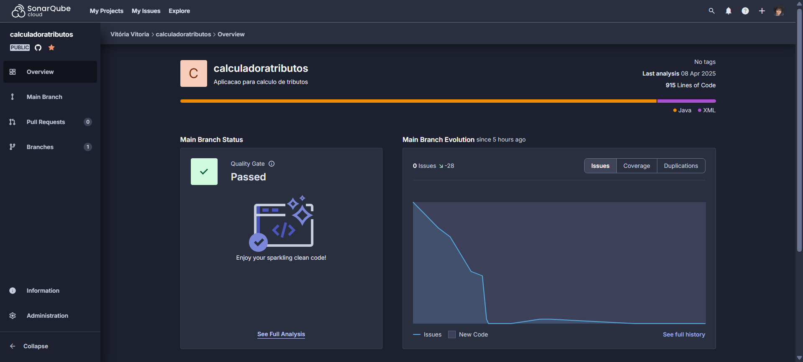

# 🧾 Gerador de Nota Fiscal

Projeto responsável por gerar **Notas Fiscais** de acordo com o tipo de pessoa (física ou jurídica), incluindo o cálculo automatizado de frete com base na região do destinatário.

---

## 🚀 Tecnologias utilizadas

- Java 11
- Spring Boot
- SonarQube
- Docker / Docker Compose

---

## 🛠️ Como executar o projeto

### 🔸 Opção 1: Usando Docker Compose

Certifique-se de ter o Docker e Docker Compose instalados na sua máquina. Em seguida, execute o comando:

```bash
docker-compose up
```
Isso irá subir todos os serviços necessários para a aplicação funcionar.

---

### 🔸 Opção 2: Executando localmente na IDE

1. Clone o repositório:
   ```bash
   git clone https://github.com/seu-usuario/geradornotafiscal.git
   ```

2. Abra o projeto em sua IDE preferida (IntelliJ, Eclipse etc.).

3. Certifique-se de ter o **Java 11** instalado.

4. Execute a classe `GeradorNotaFiscalApplication` com o ícone de "Run".

---

## ✅ Executando os testes

O projeto possui **testes unitários**. Para executá-los, siga os passos abaixo:

### 🔹 Via terminal

1. Certifique-se de estar na raiz do projeto.
2. Execute o comando Maven:

```bash
./mvnw test
```

> Se estiver no Windows, use:
```bash
mvnw.cmd test
```

### 🔹 Via IDE

1. Navegue até o diretório `src/test/java`.
2. Clique com o botão direito sobre a classe de teste desejada e selecione **"Run Tests"**.

---
## 📊 Verificação de Qualidade com SonarCloud

Este projeto utiliza o **SonarCloud** para análise de qualidade do código. A ferramenta é responsável por verificar:

- Cobertura de testes
- Código duplicado
- Bugs e vulnerabilidades
- Manutenibilidade
- Complexidade de código

A análise é feita de forma automática a cada push no repositório, garantindo a **qualidade contínua do código-fonte**.

🔎 **Acesse o relatório completo do projeto aqui**:  
👉 [SonarCloud - geradornotafiscal](https://sonarcloud.io/project/overview?id=vitoriasilva98_desafio-nota-fiscal)



---
## 📘 Documentação da API com Swagger

A API possui documentação interativa gerada automaticamente com **Swagger UI**, permitindo explorar todos os endpoints disponíveis de forma visual e prática.

Para acessar a documentação, é necessário que a aplicação esteja em execução, seja via **Docker** ou **execução local** na sua IDE.

Após iniciar o projeto, acesse:

👉 [http://localhost:8080/swagger-ui/index.html](http://localhost:8080/swagger-ui/index.html)

Com o Swagger você pode:

- Visualizar o endpoint da API
- Ver o método HTTP utilizado (POST)
- Testar o endpoint diretamente pelo navegador
- Ver o exemplo de requisição e resposta

---

